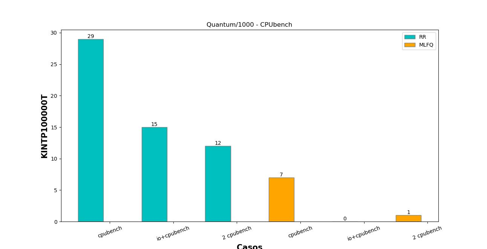

# Laboratorio 3 : Planificador de procesos
## Sistemas Operativos - FAMAF - UNC

### Grupo 17 
- Fernando Alvarado, fernando.alvarado@mi.unc.edu.ar
- Gonzalo Martyn, gonzalo.martyn@mi.unc.edu.ar
- Ivan Ponzio, ivan.ponzio@mi.unc.edu.ar
- Armando Carral, armando.carral@mi.unc.edu.ar

## Tabla de contenidos

  - [Estudiando el planifcador](#estudiando-el-planificador)
  - [Cómo el planificador afecta a los procesos](#como-el-planificador-afecta-a-los-procesos)
  - [Rastreando la prioridad de los procesos](#rastreando-la-prioridad-de-los-procesos)
  - [Implementacion MLFQ](#implementacion-mlfq)
  - [Notas importantes](#Notas-importantes)
  - [Conclusion](#conclusion)


# Estudiando el Planificador
**¿Qué política de planificación utiliza xv6 para elegir el próximo proceso a ejecutarse?**
---
XV6 utiliza la política de planificación Round-Robin (RR). 
El SO tiene una tabla de procesos de tamaño fijo y realiza un loop infinito por la misma. 
Busca el primer proceso que figura como RUNNABLE, lo corre hasta que se termina el quantum o el proceso se bloquee,
lo vuelve a planificar y pasa a mirar la siguiente entrada de la tabla. 


**a. ¿Cuánto dura un quantum en xv6?**
---
El quantum en xv6 dura 1000000 de ciclos. En segundos de qemu 1/10 aproximadamente.
```c
void
timerinit()
{
  // each CPU has a separate source of timer interrupts.
  int id = r_mhartid();
  // ask the CLINT for a timer interrupt.
  int interval = 1000000; // cycles; about 1/10th second in qemu.
  *(uint64*)CLINT_MTIMECMP(id) = *(uint64*)CLINT_MTIME + interval;
```
Para definirlo, se hace uso de los registros del CLINT (Core Local Interrupt).

CLINT provee un registro MTIME y un registro MTIMECMP por procesador.

MTIMECMP se compara contra MTIME y cada vez que sus valores coinciden, se produce una
interrupción por tiempo. 

Luego se le suma a MTIMECMP la cantidad de ciclos que deben pasar
hasta la siguiente interrupción, es decir, se programa la próxima interrupción sumando la cantidad
de ciclos. 

Todo esto está implementado en *kernelvec.S*

**b. ¿Cuánto dura un cambio de contexto en xv6?**
---
El cambio de contexto dura lo que tarda el hardwardare en hacer el save/restore de los registros.

Para esto se hace uso de la función *swtch(old_context, new_context)* implementada con assembly en*swtch.S* .

Es un código corto y de bajo nivel por lo que es bastante rápido.

**c. ¿El cambio de contexto consume tiempo de un quantum?**
---
Si, el cambio de contexto consume tiempo del quantum. Las interrupciones se manejan por hardware y son
independientes del código que se esté ejecutando (sea modo kernel o modo ususario).

Solo en muy pocas partes críticas del código de kernel se desactivan las interrupciones. 

Existen trap handlers para interrupciones en kernel space al igual que para user space.

**d. ¿Hay alguna forma de que a un proceso se le asigne menos tiempo?**
---
Si. Si bien las interrupciones por tiempo siempre se van a dar cuando se termine el quantum definido, 
hay maneras de que a un proceso se le asigne menos tiempo (un quantum mas chico) que a otros.

La funcionalidad que ofrece CLINT es mucho mas amplia de la que se usa. Hay maneras de definir y hacer convivir varios quantum
de distinto tamaño.

Por ejemplo, sería posible hacer que cada cola de prioridad tenga un quantum de distinto tamaño.

# Como el planificador afecta a los procesos

# Rastreando la prioridad de los procesos

En la estructura de procesos se agregaron los campos priority y times_called;
```c
// Per-process state
struct proc {
...
  // priority of the process and number of times the process has been called
  int priority;
  int times_called;
};
```
- Regla 3: Inicializacion de la prioridad de cada proceso. Todo proceso comienza con prioridad máxima (0)

```c
static struct proc*
allocproc(void)
{
...
found:
  p->pid = allocpid();
  p->state = USED;
  p->priority = 0;        //Regla 3
  p->times_called = 0;
...
}
```
- Regla 4: Descenso de la prioridad cada vez que el proceso pasa
todo un quantum

Siguiendo el flujo de las interrupciones, nos dimos cuenta que cada vez que se daba una interrupción por tiempo,
sea en user space o kernel, se llama a la función yield.
Por esta razón modificamos la misma para hacer el
decenso de prioridades cuando se la llama. 
```c
// Give up the CPU for one scheduling round.
void
yield(void)
{
  struct proc *p = myproc();
  acquire(&p->lock);
  p->state = RUNNABLE;
  if (p->priority < NPRIO-1)    
  {
    p->priority++;  //Regla 4
  }
  sched();
  release(&p->lock);
}
```
- Ascenso de prioridad cada vez que el proceso se bloquea antes de
terminar su quantum.

Parecido al caso de yield, cuando un proceso se bloquea, pasa al
estado SLEEPING a través de la función sleep. Por esta razón elegimos realizar un aumento de prioridad
cada vez que un proceso llama.
```c
// Atomically release lock and sleep on chan.
// Reacquires lock when awakened.
void
sleep(void *chan, struct spinlock *lk)
{
...
  // Go to sleep.
  p->chan = chan;
  p->state = SLEEPING;
  if (p->priority > 0)      //Ascenso de prioridad
  {
    p->priority--;
  }
  sched();
...
}
```

# Implementacion MLFQ
- Regla 1 : Proceso(A) > Proceso(B)

Para implementar esta regla partimos de un loop que recorre la tabla de procesos según prioridad.
Empieza buscando por procesos con prioridad máxima (0), si no encuentra ninguno, baja en uno la prioridad
y vuelve a realizar la búsqueda.

Cada vez que se termina de correr un proceso o se produce una interrupción, se comienza a recorrer la tabla desde
la prioridad máxima.

- Regla 2 : si prioProceso(A) = prioProceso(B). Corren en RR.

Para una prioridad fija, el scheduler toma el primer proceso que figura como RUNNABLE.

Para hacer el planificador un poco "mas justo" creamos un arreglo de tamaño NPROC que lleva la cuenta
del último proceso que fue ejecutado en cada prioridad. De esa manera el scheduler comienza a fijarse desde
el siguiente al último que ejecutó ( next_run[prio] ).


```c
/*Increment one in circular process table*/
...

#define CIRCULAR_INC(x) ((x + 1)% NPROC)

struct cpu cpus[NCPU];

struct proc proc[NPROC];
unsigned int next_run[NPRIO];
struct spinlock next_run_lock;

....

void
scheduler(void)
{
  struct proc *p;
  unsigned int current_p;
  struct cpu *c = mycpu();
  c->proc = 0;
  for(;;){
    // Avoid deadlock by ensuring that devices can interrupt.
    intr_on();
    for (unsigned int prio = 0u; prio < NPRIO; prio++){
      acquire(&next_run_lock);
      current_p = next_run[prio];
      release(&next_run_lock);
      do {
        p = &proc[current_p];
        acquire(&p->lock);
        if(p->state != RUNNABLE || p->priority > prio) {
          current_p = CIRCULAR_INC(current_p);
          release(&p->lock);
          continue;
        }else{
          // Switch to chosen process.  It is the process's job
          // to release its lock and then reacquire it
          // before jumping back to us.
          p->state = RUNNING;
          ++p->times_called;
          c->proc = p;
          acquire(&next_run_lock);
          next_run[prio] = current_p + 1;
          release(&next_run_lock);
          swtch(&c->context, &p->context);

          // Process is done running for now.
          // It should have changed its p->state before coming back.
          c->proc = 0;
        }
        release(&p->lock);
        break;
      } while((current_p != next_run[prio])); 
      //If a process finished running we have to search from higest priority again  
      if (current_p != next_run[prio]){
        break;
      }
    }
  }
}
```
---


## Mediciones
### CPUBENCH

La primera observación que podemos concluir es que los procesos cpubound como cpubench, se ven perjudicados con la disminución del quantum. Esto tiene que ser porque son programas que tienden a usar toda la cpu que puedan hasta que una interrupción por tiempo los saca. Al disminuirle el quantum, estamos obligandolos a hacer mas context switch y aumentar la velocidad con la que todos los procesos se van rotando el cpu.

  

### IOBENCH

En todos los casos siguientes se puede observar que a diferencia de cpubench, iobench puede resultar beneficiado con un tamaño de quantum mas chico. Alcanzando su máximo en ambas políticas con un quantum Q/10.


 

### Quantum original

Para quantum normal y analizando solo este primer caso, no encontramos diferencias significativas entre ambas políticas de planificación. Tanto para cpubench como para iobench, las métricas son muy parecidas con este tamaño de quantum.

  

### Quantum / 10

En esta medición es donde se comienzan a apreciar las primeras diferencias. Por un lado se observa una disminución de la performance de cpubench en mlfq respecto a round-robin (en todos los casos).

Para el iobench, el comportamiento es el opuesto. El efecto es mas notorio cuando hay cpubench e iobench conviviendo.

  

### Quantum / 100

Para Q/100 el comportamiento es similar al caso anterior: los cpubench se ven perjudicados con mlfq respecto a el desempeño en round-robin. Para el iobench el comportamiento es algo mas complejo: cuando hay un solo proceso (iobench) parece ir un poco mejor round-robin. Esto puede ser porque al estar corriendo solo, no hay necesidad de cambiar de contexto o de dejar de ejecutar por interrupciones. Pero la diferencia es notoria cuando hay varios procesos compartiendo cpu. En ese caso los iobench se ven muy beneficiados con mlfq.

  

### Quantum / 1000

Si bien pudimos hacer las mediciones, no creemos que estas métricas sean muy representativas. Suponemos que el SO pasa tanto tiempo haciendo context switch que no se alcanza a ejecutar casi nada. Los procesos cpubound ya de por sí muy afectados por un quantum tan chico, parecen empeorar con mlfq. Por otro lado para iobench se puede ver una mejora con mlfq en el caso en que convive con un cpubench y un rendimiento menor en el caso en que se ejecute solo o con otro iobench.

  

# Conclusiones

En un principio esperabamos que las diferencias fueran mas notorias entre ambas políticas.
La conclusión mas segura es que menor el quantum, mas perjudicados se ven los procesos cpubound. Y un quantum mas chico, (equilibrado) casi siempre mejora la performance de los procesos iobound.

Respecto a los planificadores, mlfq parece ser un poco mas justo, principalmente en los casos en que conviven varios procesos.
Los mas beneficiados siempre son los procesos iobound en los que se observan varios casos que las métricas se multiplican respecto a sus contrapartes RR.
Creemos que esto se debe a que en RR, cada vez que un cpubench está corriendo, iobench debe esperar a que se le agote el quantum.
Por otro lado, los cpubench parecen preferir round-robin ya que en mlfq terminan siempre en la prioridad mas baja. Por lo que en el caso de haber muchos procesos, es muy posible que se produzca starvation y no se alcancen a ejecutar o lo hagan muy poco.


# Punto Estrella
- Priority boost: Ascenso de prioridad por la regla 5 de MLFQ de OSTEP.

Para implementar este ítem lo que hicimos fue crear una función en proc.c que recorra toda la tabla de procesos y vaya seteando la prioridad de cada uno a la máxima.
Esta función se llama desde clockint() en trap.c que es la función encargada de incrementar los ticks cada vez que se produce una interrupción por tiempo.

Definido en proc.c
```c
//Priority boost : reset every process priority to max
//after TIMEBOOST ticks
void 
priority_boost(void)
{
  struct proc *p;
  for (unsigned int i = 0u; i<NPROC; i++){
    p = &proc[i];
    acquire(&p->lock);
    if (p->state != UNUSED ){
      p->priority = 0;
    }
    release(&p->lock);
  }
}
```

Cada vez que pasan TIMERBOOST ticks, se llama a la función que resetea todas las prioridades
```c
#define TIMERBOOST 4

...

void
clockintr()
{
  acquire(&tickslock);
  ticks++;
  if (ticks % TIMERBOOST == 0){
    priority_boost();
  }
  wakeup(&ticks);
  release(&tickslock);
}
```
--- 

**Automatizacion con scrips**
---
Dada la repetitividad de las tareas de medición nos construimos 3 scripts:

1- Script de python que compila qemu y luego le pasa a xv6 por stdin la cantidad de cpubench e iobench de cada caso. Para esto usamos el módulo subprocess, en particular la función Popen.
ej: python3 python-script.py #cpubench #iobench

2- Script de shell que hace uso del script de python para crear los archivos de salida, formateados con nombre y organizandolos en una carpeta

3- Script de shell que procesa las carpetas creadas anteriormente. Se encarga de crear dos archivos csv por cada caso, separando las mediciones de cpubench de las de iobench y organizandolas en un directorio.

